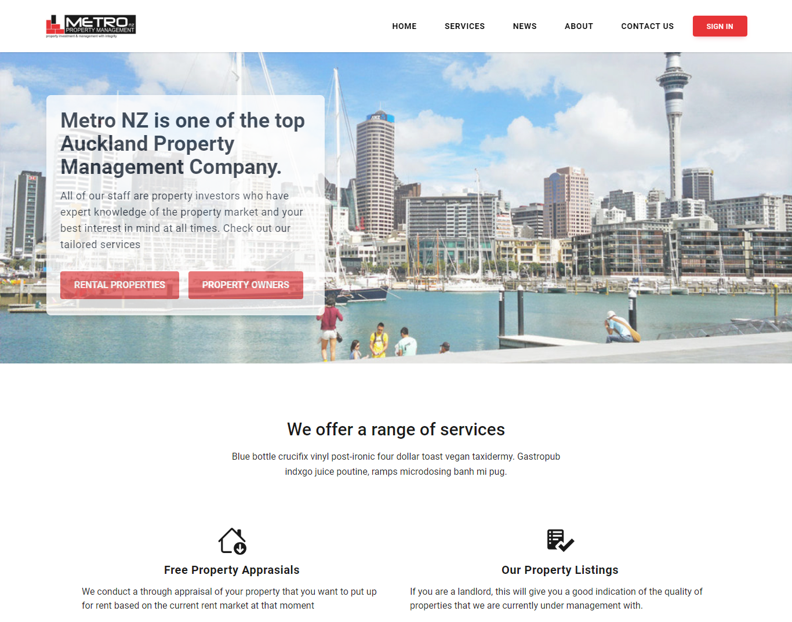
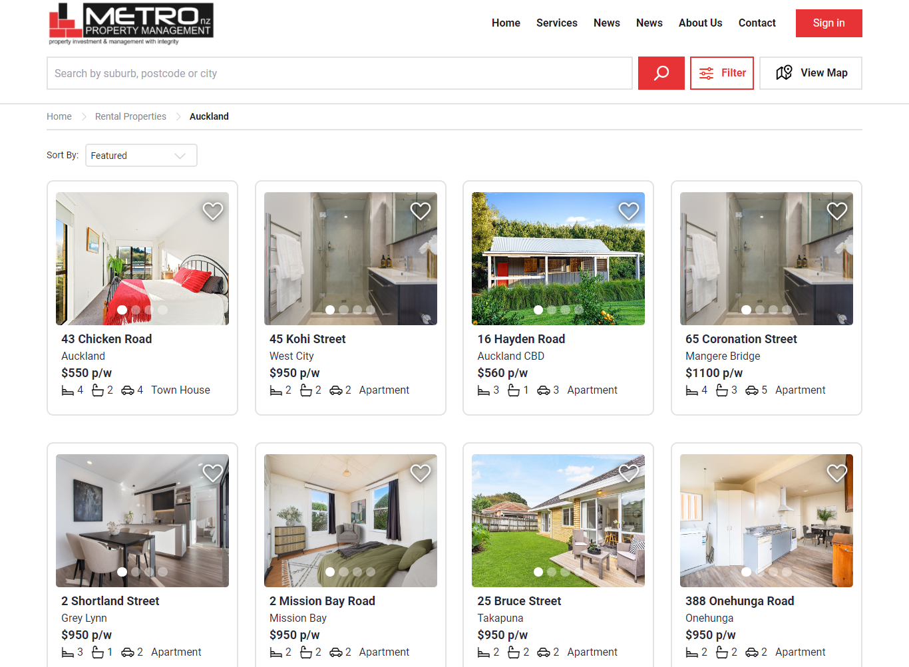
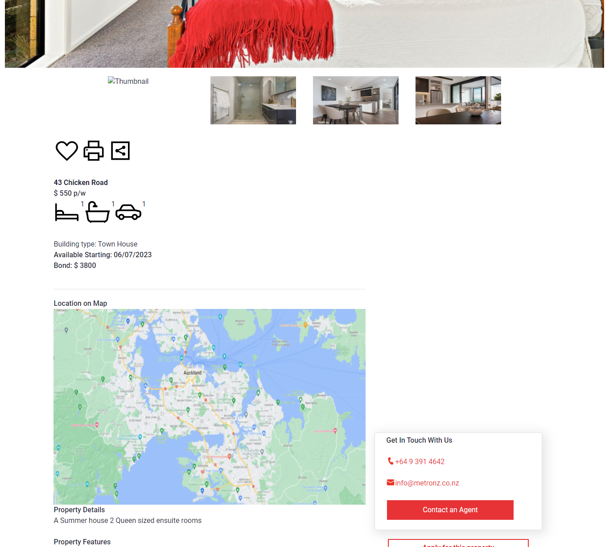

<!-- Improved compatibility of back to top link: See: https://github.com/othneildrew/Best-README-Template/pull/73 -->
<a name="readme-top"></a>
<!--
*** Thanks for checking out the Best-README-Template. If you have a suggestion
*** that would make this better, please fork the repo and create a pull request
*** or simply open an issue with the tag "enhancement".
*** Don't forget to give the project a star!
*** Thanks again! Now go create something AMAZING! :D
-->


<!-- PROJECT SHIELDS -->
<!--
*** I'm using markdown "reference style" links for readability.
*** Reference links are enclosed in brackets [ ] instead of parentheses ( ).
*** See the bottom of this document for the declaration of the reference variables
*** for contributors-url, forks-url, etc. This is an optional, concise syntax you may use.
*** https://www.markdownguide.org/basic-syntax/#reference-style-links
-->
[![Contributors][contributors-shield]][contributors-url]
[![Forks][forks-shield]][forks-url]
[![Stargazers][stars-shield]][stars-url]
[![Issues][issues-shield]][issues-url]
[![MIT License][license-shield]][license-url]
[![LinkedIn][linkedin-shield]][linkedin-url]


<!-- PROJECT LOGO -->
<br />
<div align="center">
<h3 align="center">Metro Property Redesign</h3>

  <p align="center">
  A redesign of the Metro Property Listings, using React, SCSS, Docker and MongoDB. Completed with a team of 2 designers and 3 developers.
  </p>
  <br/>
  <br/>
  
  <br/>
  
  <br/>
  
</div>


<!-- TABLE OF CONTENTS -->
<details>
  <summary>Table of Contents</summary>
  <ol>
    <li>
      <a href="#about-the-project">About The Project</a>
      <ul>
        <li><a href="#built-with">Built With</a></li>
      </ul>
    </li>
    <li>
      <a href="#getting-started">Getting Started</a>
      <ul>
        <li><a href="#prerequisites">Prerequisites</a></li>
        <li><a href="#installation">Installation</a></li>
      </ul>
    </li>
    <li><a href="#usage">Usage</a></li>
    <li><a href="#roadmap">Roadmap</a></li>
    <li><a href="#contributing">Contributing</a></li>
    <li><a href="#license">License</a></li>
    <li><a href="#contact">Contact</a></li>
    <li><a href="#acknowledgments">Acknowledgments</a></li>
  </ol>
</details>


<!-- ABOUT THE PROJECT -->
## About The Project

This was a redesign created by our UX/UI team of 2. Our team of 3 developers, including myself, then turned the wireframe into a responsive web app using React.js, TypeScript, Node.js, SCSS, Docker and MongoDB. A separate repo was created for the [backend](https://github.com/thetergus/Mission5_G3).


<p align="right">(<a href="#readme-top">back to top</a>)</p>


### Built With

* [![React][React.js]][React-url]
* 
* 
* 
* 

<p align="right">(<a href="#readme-top">back to top</a>)</p>


<!-- GETTING STARTED -->
## Getting Started

This is an example of how you may give instructions on setting up your project locally.
To get a local copy up and running follow these simple example steps.

### Prerequisites

This is an example of how to list things you need to use the software and how to install them.
* npm
  ```sh
  npm install npm@latest -g
  ```
* yarn
* docker
* mongodb

### Installation

1. Clone this frontend repo to a parent folder
   ```sh
   git clone https://github.com/mind-ll-matter/Metro_Frontend-MRHQ_mission5.git
   ```
2. Install NPM packages for the frontend
   ```sh
   npm install
   ```
 3. Clone the [backend repo](https://github.com/thetergus/Mission5_G3) to the same parent folder
   ```sh
   git clone https://github.com/mind-ll-matter/Metro_Frontend-MRHQ_mission5.git
   ```
4. Install the yarn packages for the backend
   ```sh
   yarn add
   ```

<p align="right">(<a href="#readme-top">back to top</a>)</p>


<!-- USAGE EXAMPLES -->
## Usage

The app has been set up to use docker compose with a mongo database. What happens is that the backend will be run in a docker container. The data associated with that container will be stored in the mongodb database. The frontend then interacts with the database to acquire, add or change data.

1. To run the project, you will first need to run the backend:
   ```sh
   docker compose up
   ```

 2. Then, run the frontend:
   ```sh
    npm run start
   ```

<p align="right">(<a href="#readme-top">back to top</a>)</p>


<!-- ROADMAP -->

<!-- CONTRIBUTING -->

<!-- LICENSE -->

<!-- CONTACT -->
## Contact

Project Link: [https://github.com/mind-ll-matter/Metro_Frontend-MRHQ_mission5](https://github.com/mind-ll-matter/Metro_Frontend-MRHQ_mission5)

<!-- ACKNOWLEDGMENTS -->
## Acknowledgments

### Our UX/UI Team
* [Renee M.]
* [Zoe Y.]

### Our Dev Team
* [AJ](https://github.com/mind-ll-matter)
* [Vidya](https://github.com/vidya0206)
* [Gus](https://github.com/thetergus)

<p align="right">(<a href="#readme-top">back to top</a>)</p>


<!-- MARKDOWN LINKS & IMAGES -->
<!-- https://www.markdownguide.org/basic-syntax/#reference-style-links -->
[contributors-shield]: https://img.shields.io/github/contributors/mind-ll-matter/Metro_Frontend-MRHQ_mission5.svg?style=for-the-badge
[contributors-url]: https://github.com/mind-ll-matter/Metro_Frontend-MRHQ_mission5/graphs/contributors
[forks-shield]: https://img.shields.io/github/forks/mind-ll-matter/Metro_Frontend-MRHQ_mission5.svg?style=for-the-badge
[forks-url]: https://github.com/mind-ll-matter/Metro_Frontend-MRHQ_mission5/network/members
[stars-shield]: https://img.shields.io/github/stars/mind-ll-matter/Metro_Frontend-MRHQ_mission5.svg?style=for-the-badge
[stars-url]: https://github.com/mind-ll-matter/Metro_Frontend-MRHQ_mission5/stargazers
[issues-shield]: https://img.shields.io/github/issues/mind-ll-matter/Metro_Frontend-MRHQ_mission5.svg?style=for-the-badge
[issues-url]: https://github.com/mind-ll-matter/Metro_Frontend-MRHQ_mission5/issues
[license-shield]: https://img.shields.io/github/license/mind-ll-matter/Metro_Frontend-MRHQ_mission5.svg?style=for-the-badge
[license-url]: https://github.com/mind-ll-matter/Metro_Frontend-MRHQ_mission5/blob/master/LICENSE.txt
[linkedin-shield]: https://img.shields.io/badge/-LinkedIn-black.svg?style=for-the-badge&logo=linkedin&colorB=555
[linkedin-url]: https://linkedin.com/in/linkedin_username
[product-screenshot]: images/screenshot.png
[Next.js]: https://img.shields.io/badge/next.js-000000?style=for-the-badge&logo=nextdotjs&logoColor=white
[Next-url]: https://nextjs.org/
[React.js]: https://img.shields.io/badge/React-20232A?style=for-the-badge&logo=react&logoColor=61DAFB
[React-url]: https://reactjs.org/
[Vue.js]: https://img.shields.io/badge/Vue.js-35495E?style=for-the-badge&logo=vuedotjs&logoColor=4FC08D
[Vue-url]: https://vuejs.org/
[Angular.io]: https://img.shields.io/badge/Angular-DD0031?style=for-the-badge&logo=angular&logoColor=white
[Angular-url]: https://angular.io/
[Svelte.dev]: https://img.shields.io/badge/Svelte-4A4A55?style=for-the-badge&logo=svelte&logoColor=FF3E00
[Svelte-url]: https://svelte.dev/
[Laravel.com]: https://img.shields.io/badge/Laravel-FF2D20?style=for-the-badge&logo=laravel&logoColor=white
[Laravel-url]: https://laravel.com
[Bootstrap.com]: https://img.shields.io/badge/Bootstrap-563D7C?style=for-the-badge&logo=bootstrap&logoColor=white
[Bootstrap-url]: https://getbootstrap.com
[JQuery.com]: https://img.shields.io/badge/jQuery-0769AD?style=for-the-badge&logo=jquery&logoColor=white
[JQuery-url]: https://jquery.com 
